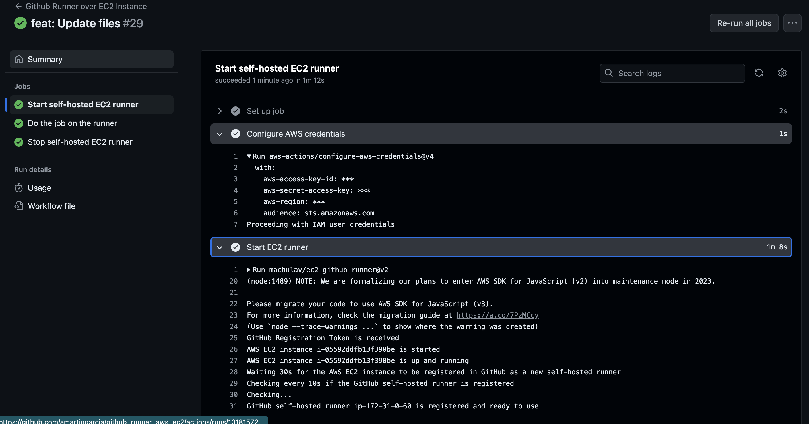
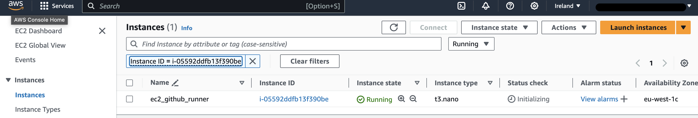
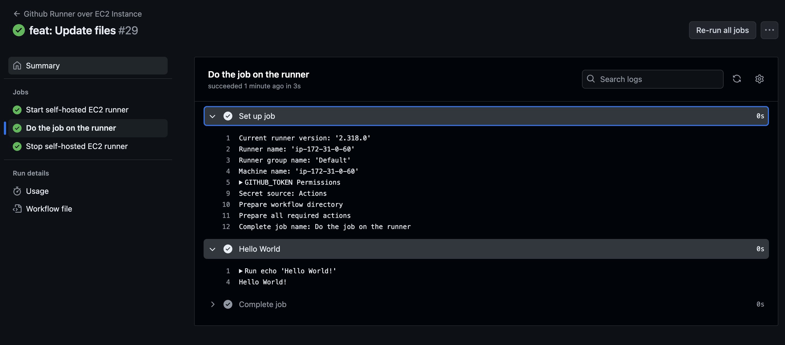
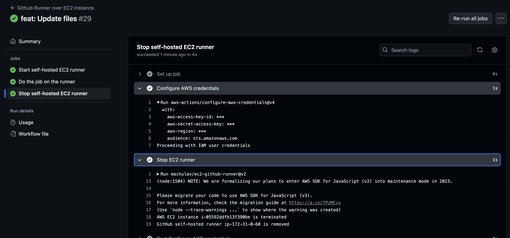
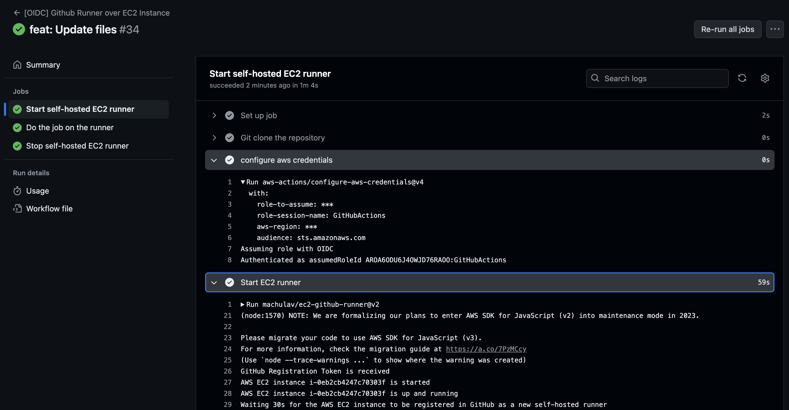
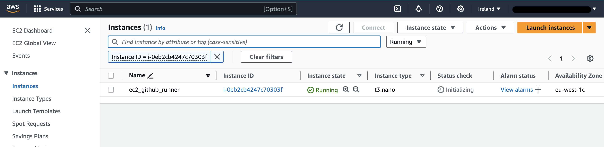
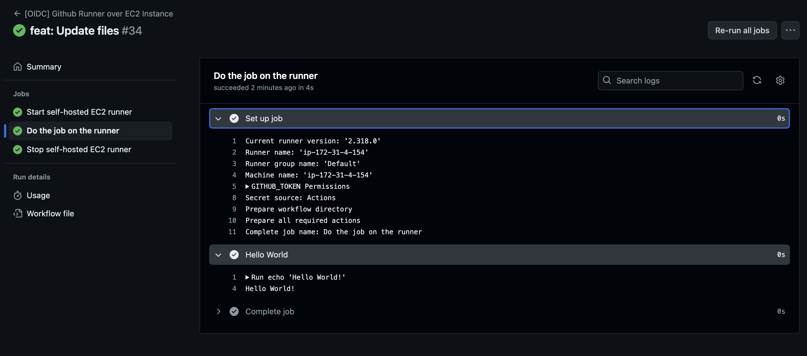
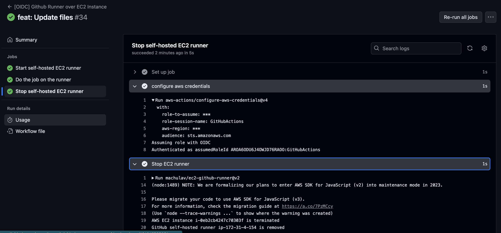

# github-runner-aws-ec2

This repository allows you to configure an AWS account and a GitHub repository to create an AWS EC2 Instance and use it as a GitHub runner during the execution of the Workflow, using the action [aws-actions/configure-aws-credentials](https://github.com/aws-actions/configure-aws-credentials):

This demo covers two cases: authentication with AWS via Access Key and Secret Key, and authentication with OIDC.

In both cases, you will first need a GitHub PAT with full `repo` permissions.

Next, create a `terraform.tfvars` file in the `terraform` directory with the following details:
```bash
region            = "" # AWS region
access_key        = "" # Access key of an admin user in AWS
secret_key        = "" # Secret key of an admin user in AWS
github_repository = "" # Name of the GitHub repository
github_token      = "" # PAT for your repository with repo scope
aws_subnet_id     = "" # Subnet ID where you will deploy your runners
vpc_id            = "" # VPC ID where you want to deploy your runners
```

The links I used as a reference are as follows:
* Access key and secret key -> https://github.com/marketplace/actions/on-demand-self-hosted-aws-ec2-runner-for-github-actions
* OIDC -> https://aws.amazon.com/blogs/security/use-iam-roles-to-connect-github-actions-to-actions-in-aws/


Check the files:
* [runner-ec2.yaml](.github/workflows/runner-ec2.yml) to understand this scenario.
* [runner-oidc.yaml](.github/workflows/runner-oidc.yml) to understand this scenario.

Also, review the Terraform files. Afterward, run terraform apply.

Once applied, add the changes to your repository and check that both pipelines are running correctly.

## Access key y Secret key
### Start instance


### Ec2 console


### Run command


### Stop instance


## Con OIDC
### Start instance


### Ec2 console


### Run command


### Stop instance

